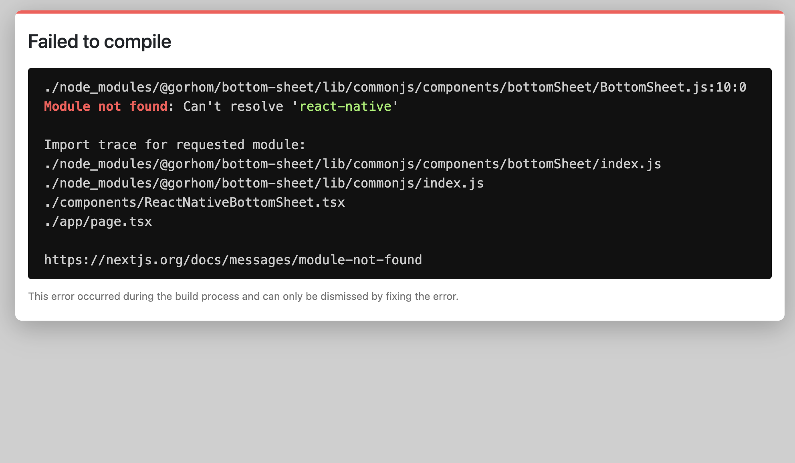

## Table of Contents

- [Overview](#Overview)
- [Current-State](#Current-State)
- [Acceptance-Criteria](#Acceptance-Criteria)
- [Stand-Alone-App-Description](#Stand-Alone-App-Description)
- [Tried-Packages](#Tried-Packages)
- [React-Bottom-Sheet](#React-Bottom-Sheet)
- [Spring-Bottom-Sheet](#Spring-Bottom-Sheet)
- [Chakra-Modal](#Chakra-Modal)
- [React-Native-Library](#React-Native-Library)

# Overview

For our mobile app, we wanted to show selected parcel information in a bottom sheet. We have quite a lot and important data we wanted to show in the bottom sheet. We used [React-Bottom-Sheet] (https://github.com/Temzasse/react-modal-sheet) but it has some problems.Such as:

- When we enable the drag option to true then we fail to scroll the information. If we disable the drag option, only then we are able to scroll.
- We have nested tabs in our component. And one of them is horizontally scrollable. However, if we use this package and disable the dragging option, then our horizontally scrollable tabs don't work.

# Current-State

Currently our app is working but our #modal-sheet working more likely as a modal. Dragging is not possible but we are using a cross icon to close the "modal-sheet". Mulitple scrollbar is not there but horizontal scrollbar is somewhat working but not smoothly. Of course it's not user friendly as it will be difficult to figure out for a user how to scroll .

# Acceptance-Criteria

- Research alternative components that we can use for the mobile view of our app

- Implement them in a small stand-alone app with all relevant use cases to ensure and demonstrate that it fits our requirements.

- The component should be draggable

- Contents within the card should be scrollable if the content does not fit within the space.

- The interaction with the tabs control must be verified - there was a problem with the tab control and the card component each having their own scroll bars, resulting in a bad UX.

# Stand-Alone-App-Description

Here I have created a basic nextjs app where I am using multiple tabs components with a couple of libraries and possible components.

# React-Bottom-Sheet

Using React Bottom Sheet, I faced same problems that had happened in our app. If I enable the drag option then I fail to scroll down but horizontal scrolling of the tabs worked. And if I disable the drag option vertical scrolling of the app works but horizontal scrolling like our app does not work smoothly. HOWEVER, in there doc I found if I want the sheet to be draggable, I need to enable overflow of the content to Auto or scroll. I tried but it did not work.

I created an issue regarding the problem and 3 people also found same issue. Here is the link: [https://github.com/Temzasse/react-modal-sheet/issues/103](https://github.com/Temzasse/react-modal-sheet/issues/103)

# Spring-Bottom-Sheet

This was a great package/ library, in fact it is better than React-Bottom-sheet. It sadly did not work for my app. Even it shows some error as and stop app running. After the release of React v18, it is not woking anymore. Many people created issue regarding this. And I found that, developer is creating this package from the scratch.

- [Issue 1](https://github.com/stipsan/react-spring-bottom-sheet/issues/236)
- [Issue 2](https://github.com/stipsan/react-spring-bottom-sheet/issues/210)

# Chakra-Modal

It solves our scrolling problem. Using **Chakra-modal** both of the horizontal and vertical scrolling is working smoothly. It somewhat solves our problem but unlike **Bottom Sheet** it does not show up at the bottom of the screen because modal usually shows up in the middle of the screen. And it is naturally not draggable.

# Chakra-Drawer

**Chakra Drawer** can be used insted of **Bottom Sheet** in this case. Using **Chakra Drawer** scrolling bothe horizontally and vertical working smoothly. Also, the **Nested Tab** is also working fine. It is staying on the bottom of the screen and animation is like **Bottom Sheet**. The only thing we have to sacrifice is dragging to bottom. We can not do the dragging here. :thinking:

# React-Native-Library

I also tried with some React Native Bottom Sheet but I found this error when I tried to use. N.B. I replaced React Native syntax with React Syntax.

But it's possible to use React-Native-Library in React project, need to find out how!!
